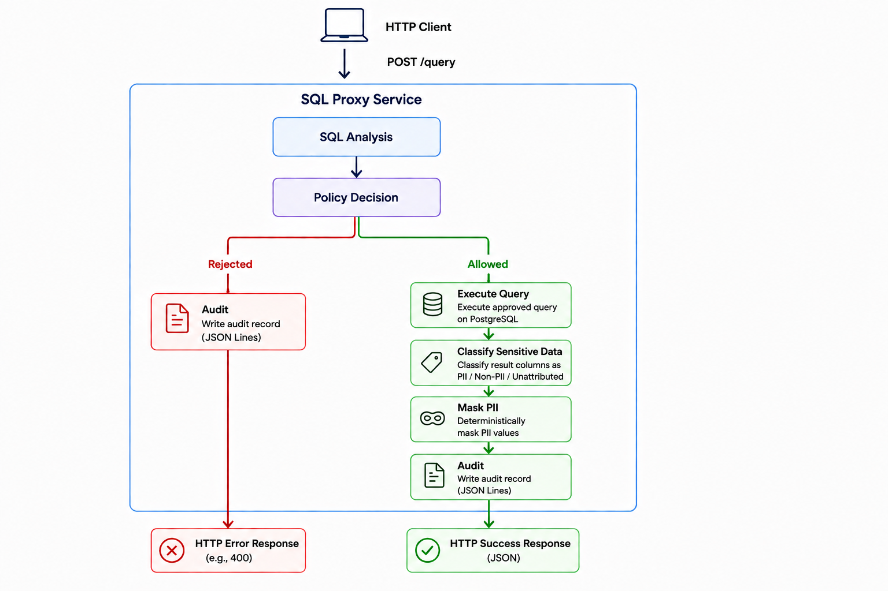

# SQL Proxy Service

A security-focused SQL proxy for PostgreSQL.

The service receives SQL statements, analyzes them before execution, applies a fail-closed access policy, executes approved queries, classifies sensitive result columns, masks PII, and writes structured audit records.

The implementation prioritizes four goals:

- Make security decisions explicit and predictable.
- Reject SQL that cannot be analyzed safely.
- Keep business logic independent from infrastructure libraries.
- Minimize sensitive data exposure throughout the pipeline.

## Assignment coverage

| Evaluation area | Implementation |
|---|---|
| SQL Analysis | AST-based parsing with `hyrise/sql-parser`, followed by a parser-independent analysis model. |
| Correctness of SQL Analysis | Unsupported, unparseable, or ambiguous SQL is rejected instead of being partially interpreted. |
| Masking Enforcement | Masking is centralized, deterministic, and applied before results leave the service. |
| Classification Logic | Query analysis is combined with actual result-column metadata. Unknown attribution is kept separate from non-PII. |
| Audit Quality | Query outcomes are stored as structured JSON Lines records without SQL text, values, identifiers, or driver error messages. |
| System Log | Startup, configuration, server lifecycle, and audit persistence failures are logged separately from the audit trail. |
| Data Setup | Docker Compose initializes PostgreSQL from version-controlled schema and seed scripts. |
| Overall Design | Core logic is separated from HTTP, SQL parser, PostgreSQL, and file-persistence details through project-owned interfaces. |

## Architecture



`ProxyService` coordinates the request flow. Each stage has one responsibility:

| Component | Responsibility |
|---|---|
| `SqlAnalyzer` | Converts parser output into the project's SQL analysis model. |
| `PolicyEngine` | Decides whether the analyzed statement may execute. |
| `IQueryExecutor` | Defines the database-neutral execution contract. |
| `DataClassifier` | Attributes result columns and identifies PII categories. |
| `PiiMasker` | Applies deterministic masking to classified values. |
| `IAuditRepository` | Persists structured request outcomes. |

Third-party types remain inside their adapters:

- Hyrise types stay inside the SQL parser adapter.
- libpqxx types stay inside the PostgreSQL adapter.
- cpp-httplib types stay inside the HTTP adapter.

The core depends only on project-defined types and interfaces. This keeps it independently testable and prevents infrastructure libraries from defining business behavior.

## Why this design?

### SQL analysis

**Why?**

Security decisions cannot safely depend on string matching. Comments, quoting, aliases, casing, and nested syntax make text-based SQL inspection unreliable.

**Implementation**

The service parses SQL into a real AST using `hyrise/sql-parser`. The adapter converts parser-specific objects into a project-owned `ParsedStatement`, and `SqlAnalyzer` produces a parser-independent `SqlAnalysis`.

The analysis records, on a best-effort basis:

- statement type and class;
- statement count;
- referenced tables;
- SELECT projection columns;
- DML affected columns;
- wildcard and computed-projection flags;
- whether the projection is a canonical `COUNT(*)`;
- whether the statement has a `GROUP BY`;
- unsupported features.

**Trade-off**

The service supports a bounded SQL subset. SQL that cannot be understood confidently is rejected. Broader coverage is valuable only if it preserves fail-closed behavior.

### Policy enforcement

**Why?**

The service does not implement authentication, user identity, roles, or write authorization. Without a trusted identity, it cannot determine whether a caller should be allowed to modify database contents.

**Implementation**

The proxy follows a strict read-only policy:

- supported single-statement `SELECT` queries may proceed;
- DDL and DML are rejected before execution;
- multiple statements are rejected;
- unsupported statement types and features are rejected;
- system-catalog access is rejected;
- projection shapes that cannot be handled safely are rejected.

Policy decisions use typed rejection reasons rather than free-form strings.

The PostgreSQL account should also use a least-privilege, read-only role. The application policy is one layer of protection, not a replacement for database permissions.

**Trade-off**

The policy intentionally sacrifices write capabilities in exchange for a smaller and safer authorization model. This prevents the proxy from becoming a route for accidental or malicious data modification.

### Classification logic

**Why?**

A sensitive column must not be treated as safe simply because its source cannot be determined.

**Implementation**

Classification combines:

- the analyzed SELECT projection;
- the column metadata returned by PostgreSQL;
- a configurable, case-insensitive mapping of known PII column names.

Each result column receives one of three states:

- `Pii`
- `NotClassifiedAsPii`
- `Unattributed`

`Unattributed` is intentionally distinct from non-PII. The classifier never guesses when attribution is incomplete.

The supported PII categories are:

- `PII.Email`
- `PII.Phone`
- `PII.CreditCard`

The classifier receives column metadata only. It does not inspect row values, so sensitive values cannot enter or leak from the classification component.

**Aggregates: the canonical `COUNT(*)`**

Computed expressions normally cannot be attributed to a source column, so they are refused. One shape is recognized as safe and executed: the canonical `COUNT(*)`. It counts rows and never reads the contents of a column, so its result has no lineage to any stored value and cannot carry PII.

Recognition happens in the parser adapter and is deliberately narrow. It requires a `COUNT` call, without `DISTINCT`, without a window clause, with exactly one argument that is the star. Attribution is then by shape rather than by name, so `SELECT COUNT(*) AS email` is still a count and is returned intact rather than masked.

Everything else in the family remains refused exactly as before, including `COUNT(1)`, `COUNT(NULL)`, `COUNT(column)`, `COUNT(DISTINCT column)`, `COUNT(*) OVER (...)`, `COUNT(*) + 1`, `MIN`/`MAX`/`SUM`/`AVG`, any grouped count, and any projection that mixes a count with a column, a wildcard, or another expression.

**Trade-off**

Metadata-based classification is predictable and testable, but it cannot identify sensitive data stored under an unexpected or misleading column name.

Supporting only the canonical `COUNT(*)` means `COUNT(1)` is rejected even though SQL treats the two as equivalent. That is deliberate: the goal is one well-defined safe shape rather than a family of variants, and each additional form widens the surface that has to be kept safe.

### Masking enforcement

**Why?**

Sensitive values must be transformed before any successful result leaves the proxy.

**Implementation**

Masking occurs after execution and classification, using the actual result-column order.

The rules are deterministic and category-specific:

```text
Email
lihi.roas@example.com -> l***@example.com

Phone
0501230101 -> ***0101

Credit card
4111111111111111 -> ****1111
```

The same category always follows the same masking rule.

`NULL` remains `NULL`, and an empty string remains an empty string. The masker does not invent values where none exist.

Before changing any result cell, the masker validates the complete classification and result shape. If masking cannot be applied safely, no partially masked result is returned.

**Trade-off**

The implementation uses deterministic redaction rather than tokenization, encryption, or reversible masking. These techniques provide different operational properties but are outside the scope of this service.

### Audit quality

**Why?**

An audit trail should record request outcomes without becoming another source of sensitive-data leakage.

**Implementation**

Every request handled by the SQL pipeline produces one structured JSON Lines audit record.

The record uses closed enums and numeric fields. It intentionally excludes:

- raw or normalized SQL;
- query values;
- table and column names;
- result values;
- database error messages;
- connection strings;
- file paths.

Successful results are not returned if the audit record cannot be persisted.

**Trade-off**

Excluding SQL and identifiers reduces forensic detail. This is an intentional privacy decision. The audit records what happened to the request, not its full payload.

### System log

The system log is separate from the audit trail.

It currently records operational events such as:

- startup and configuration;
- the HTTP listening port;
- startup failures;
- audit persistence failures.

It does not log SQL, identifiers, values, or database error text.

Request-level latency, status metrics, and operational counters are possible future improvements.

## Data setup

The repository includes a demonstration schema and fabricated seed data:

```text
sql/
├── schema.sql
└── seed.sql
```

The schema contains `customers` and `orders`. The dataset covers:

- email, phone, and credit-card masking;
- joins and wildcard projections;
- aliases;
- `NULL` and empty-string behavior;
- allowed and rejected policy outcomes.

All stored card numbers are publicly documented, non-transactable test values.

## Quick start

Requirements:

- Docker
- Docker Compose

```bash
git clone https://github.com/lihiSabag/SQL-Proxy-Service.git
cd SQL-Proxy-Service
docker compose up --build -d
```

Check that the service is running:

```bash
curl http://localhost:8080/health
```

Expected response:

```json
{"status":"ok"}
```

Run a query:

```bash
curl -X POST http://localhost:8080/query \
  -H "Content-Type: application/json" \
  -d '{"sql":"SELECT id, name, email, phone, credit_card FROM customers ORDER BY id"}'
```

Example masked row:

```json
["1", "Lihi Roas", "l***@example.com", "***0101", "****1111"]
```

Stop the environment:

```bash
docker compose down -v
```

## Testing

The project contains 198 tests:

| Suite | Count |
|---|---:|
| Unit | 152 |
| HTTP contract | 12 |
| PostgreSQL integration and end-to-end | 34 |
| **Total** | **198** |

The test suites cover:

- parser and analyzer contracts;
- policy rule order and rejection reasons;
- real PostgreSQL execution;
- classification and masking invariants;
- structured audit persistence;
- HTTP response behavior;
- the complete production pipeline with a real database.

## Known limitations

- SQL coverage is intentionally bounded by the parser and adapter.
- Some advanced `ALTER TABLE` syntax is unsupported.
- Computed projections that cannot be attributed safely are refused instead of being returned without masking. The canonical `COUNT(*)` is the one recognized exception; `COUNT(1)` and every other variant remain refused.
- Table references hidden inside some subqueries may not be visible to the analyzer.
- Identifier normalization follows a simplified ASCII case model rather than full PostgreSQL identifier semantics.
- Requests are currently processed serially, and each execution opens a short-lived database connection.
- Audit writes are flushed, but host-crash durability through `fsync` is not guaranteed.
- Authentication, authorization, and role-aware policy are not implemented.
- A statement timeout is currently reported as HTTP 400 together with other execution failures.

### Predicate inference

The proxy prevents direct disclosure of sensitive values in query results. It does not attempt to prevent inference through repeated predicates over sensitive columns.

For example, a caller may learn information from repeated `WHERE` conditions even when the sensitive column is not included in the returned projection.

Production systems usually address this broader threat with complementary controls such as:

- trusted user identity and authorization;
- rate limiting;
- query-pattern monitoring;
- anomaly detection;
- operational alerting;
- predicate-aware access policies.

Output masking alone is not intended to solve this class of inference attack.

## Future work

Potential extensions include:

- broader parser coverage while preserving fail-closed behavior;
- predicate-aware policy enforcement;
- role-aware authorization;
- safe support for selected computed expressions;
- additional PII categories;
- request-level operational metrics;
- connection pooling and concurrent request processing;
- configurable audit durability.